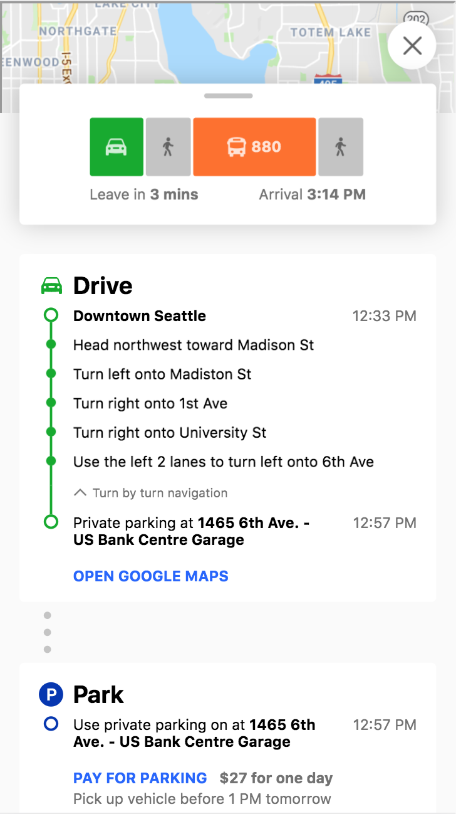

<p float="left">
  
</p>

# ModeShift-App:  Seattle Area Incident Avoidance

## Team website
[Team Webpage](https://annykong.github.io/ModeShift-App/)  |
[Team GitHub Repo](https://github.com/AnnyKong/ModeShift-App)  
*Our Clikcable Demo can be found under the "PROTOTYPE & DEMO" section.*

## Our team


- **Pari Gabriel (HCDE): Project Manager**  
  Pari is an organized and detail-oriented student who will be taking lead of the capstone. He will be in charge of   coordinating internal team meetings, submitting reports, and keeping track of the team’s progress throughout the duration of the project.

- **Chris Angkico (Communications): Marketing Lead**  
  Chris is an experienced researcher and marketing plan writer that will be assigned the role of marketing lead. He will be in charge of evaluating expert and focus group interview information, as well as any pre-existing research information the group collects, to develop a comprehensive strategy to market and advertise our transit incident reporting solution, making sure it gets out to as many different road users as possible. 

- **Yuki Asakura (HCDE): Data Lead**  
  Yuki, an HCDE student familiar with conducting research and survey studies, will be the team’s Data Lead. He will be responsible of collecting data across all tasks to draw insights on the problem space and provide recommendations for our solution.

- **Steven Tuttle (CEE): External Coordinator**  
  Steven is a student in Civil and Environmental Engineering and is familiar conducting research and managing communications for interviews and surveys. He will be responsible for managing external communications between the team and other transit agencies and project mentors.

- **Catherine Wang (CEE): Implementation Lead**  
  Catherine is a civil engineering student with cross-functional experience in technical work with users in mind. She will be in charge of deliverable of technical analysis. 

- **Anny Kong (CSE): Modeling Lead**  
  Anny is a Computer Science student skilled in mathematical modeling and software programming. She will take the lead for overall model development, demo implementation and analysis across all tasks.

## Project Overview
#### A mobile-friendly Website for general population incident avoidance

This is a UW cross-disciplinary Capstone project sponsored by Challenge Seattle, WSDOT, and King County Metro amongst many other companies and organizations in the public and private sector.

When traffic incidents occur in the Greater Seattle area, our sponsors relay important information through social 
media, traditional media, electronic roadway signs, and low-power radio stations along with some rare usage of 
mobile alert systems such as AlertSeattle. While these methods reach a broad group of road users, they fail to 
reach every road user and do not provide adequate solutions in the form of real-time transit recommendations and 
updates. They are also not able to reach every consumer with specific information about incidents and the best 
course of action to take. Our sponsors are seeking recommendations for innovative solutions for wide-reaching 
notification of traffic incidents and solutions for transportation mode-shifting, departure time recommendations, 
and route shifts during and shortly after traffic incidents.

### Problem Statement 
*How might we innovate forms of transit incident reporting to the general public and provide accessible, 
mobile solutions for their needs in a timely manner?*

### Goals
Our goal is to create an innovative solution that can help the general public navigate or avoid major incidents 
and related congestion. When a major incident or multiple major incidents occur, our solution will provide a 
platform where users can be informed of congestion information, departure time shifts, routing recommendations, 
and support for transportation mode shifting. It is developed with assumptions of the ongoing development of a 
Traffic Incident Management - Congestion Management "Virtual Command Center"

We identified two areas of importance that we focus on for this project: 
1. How user groups can better access or take advantage of current ticketing apps through marketing, 
partnerships, incentives, etc?
2. Recommend design guidelines Metro should consider requiring for future mobile ticketing apps.
    - Promptly informing the general population of incidents which impact their commute
    - Behavior change and modeshift behavior reinforcement

##  Final Clickable Demo 
[Demo Webpage](https://annykong.github.io/uwcapstone-modeshift/)(https://annykong.github.io/uwcapstone-modeshift/)  |
[Demo GitHub Repo](https://github.com/AnnyKong/uwcapstone-modeshift)
<p float="left">
  
   
  
  
   
    
<!--    -->
</p>

### Overview
Our solution is an interactive, mobile-friendly website which will be hosted on one of the transit agency’s servers. If an incident happens, the server will be activated and the website link will appear active on the official website of King County Metro (KCM), Washington State Department of Transportation (WSDOT), and Seattle Department of Transportation (SDOT), Sound Transit, as well as any other relevant transit agencies. The link would also be sent to Alert Seattle customers as well as those who subscribe to KCM, Sound Transit and WSDOT text alerts directing them to the website. 
#### System Design Overview
 

### Instructions to view on Desktop
- *Please use **mobile** for clickable demo, the Desktop version is only for demonstration of the Desktop design*.
- If you want to **view the Mobile version on Desktop**, please follow instructions below:
    - Make sure you are using **Chrome** browser
    - **Right click** on page and select **"Inspect"**
        - 
    - On **top right** of the page, click **"Toggle device toolbar"** to switch to the mobile version
        - 
    - On **top left** of the page, click on the red the area below, you may select any phone type you want
        - 
    - You are now ready to test the mobile version!
p.s. To go back to the Desktop version, just click on the "Toggle device toolbar" again
        - 
	
## Tests
[Map Test](https://annykong.github.io/test-map/) |
[Map Test Repo](https://github.com/AnnyKong/test-map)

### Iterations
- [1st Iteration](https://annykong.wixsite.com/modeshift-19sp)
- [2nd iteration Code (no server)](https://github.com/AnnyKong/ModeShift-App/commits/master)
- [2nd iteration Code (with server)](https://github.com/AnnyKong/ModeShift-App/commits/gh-pages)
- [3rd iteration (Web Design)](https://uwcapstone.webflow.io/)
- [Current version (Combined Design and functionalities)](https://annykong.github.io/uwcapstone-modeshift/)

### Instructions to use your GoogleMap API key
- Get your own key [here (Get Google API Key)](https://developers.google.com/maps/documentation/javascript/get-api-key).
- And then, in `test-map/docs/index.html`, substitute `replacekey` in the code below with the API key you got from the previous step.
  ```
  <script  id="google" async defer
           src="https://maps.googleapis.com/maps/api/js?key=replacekey&callback=initMap"
  async defer></script>
  ```

## Figma figure export helper
https://ui-kit.co/figma2html/

